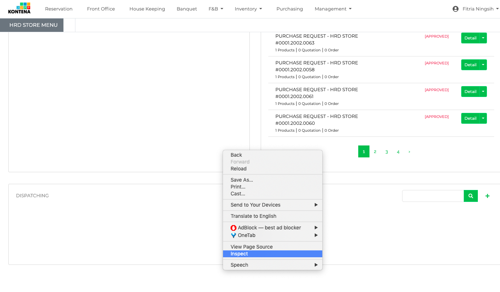
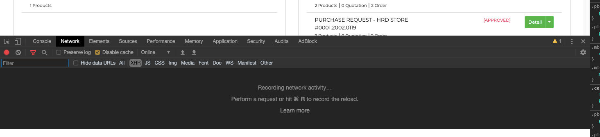
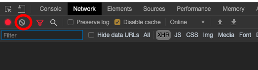
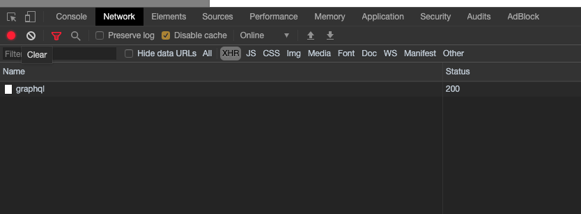
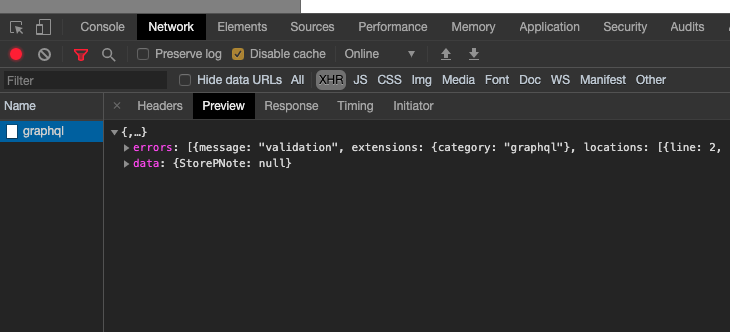
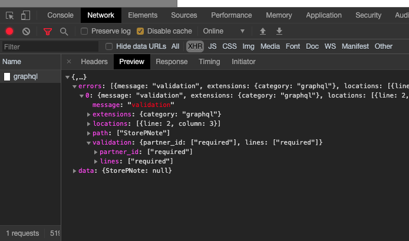

# Error

> Step by step untuk check error sistem

- Pertama klik kanan lalu cari **Inspect** atau **Inspect Element**
  <figure align="center">
    
    <figcaption align="center">Inspect</figcaption>
  </figure>
- Pilih ke tab **Network**
  <figure align="center">
    
    <figcaption align="center">Tab Network</figcaption>
  </figure>
- Setelah itu klik tombol merah yang dibulatkan.
  <figure align="center">
    
    <figcaption align="center">Button Clear</figcaption>
  </figure>
- Terus coba kembali untuk Fitur yang tadi Error.
- Kalau muncul **Error**, lihat kotak tadi nanti ada tulisan **graphql** itu diklik.
  <figure align="center">
    
    <figcaption align="center">Result</figcaption>
  </figure>
- Akan muncul detailnya. klik di **Preview**.
  <figure align="center">
    
    <figcaption align="center">Result 2</figcaption>
  </figure>
- Jika sudah nanti ada tulisan **errors**, itu klik panahnya lalu akan **0**.
- Dan jika ada tulisan **validation** klik lagi panahnya.
  <figure align="center">
    
    <figcaption align="center">Result 3</figcaption>
  </figure>
- Setelah itu minta tolong untuk ScreenShoot isinya.
- Lalu kirim hasil Screenshoot dan Prosesnya apa.